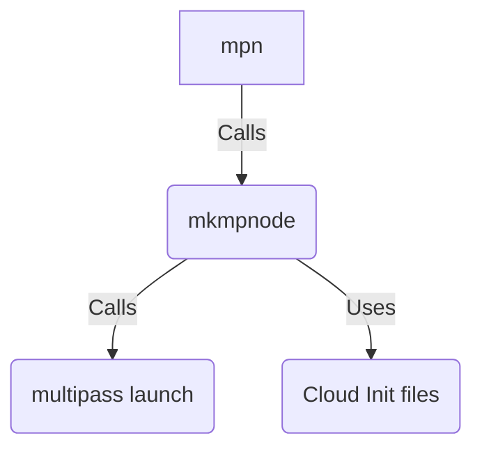

# Introduction - mptools

`mptools` Is a utility package for macOS to both help with installation of `multipass` 
(with adaptations) but is primarily a help to create `multipass` 
nodes initialized with the help of (automatically customized) cloud-init config files. 
These scripts allow for several
levels of customization/usage depending on needs.

In its simplest form (after installing) nodes can be created using a naming convention
that specifies how to initialize the node as well as (some of) the specification for
the virtual machine such as RAM and disk.

After installing, nodes can be created as the following basic example show. 
The example below will use two ways to create identical node instances, 
the hard- and the easy-way.

First lets do it the hard (and most flexible) way

```shell
% mkmpnode -c fulldev-config.yaml -m 2GB -d 10GB -r bionic ub18fl01
```

then, the exact same node can also be created more easily 
using the node naming conventions as

```shell
% mpn ub18fl01 
```
All details as well as the naming convention used is documented below, see
[Node naming convention](#node-naming-convention) for the naming specification.


# Content
- [Installing the package](#installing-the-package)
    - [Changing install location](#changing-install-location)
- [Quickstart](#quickstart)
- [Installing multipass](#installing-multipass)
- [Creating generic nodes](#creating-generic-nodes)
    - [Cloud init files](#cloud-init-files)
    - [Resolving location of cloud-init files](#resolving-location-of-cloud-init-files)
    - [Examples of creating custom nodes](#examples-of-creating-custom-nodes)
- [Creating nodes using naming conventions](#creating-nodes-using-naming-conventions)
    - [Node naming convention](#node-naming-convention)
- [Creating nodes using make](#creating-nodes-using-make)
    - [Examples of using the Makefile directly](#examples-of-using-the-makefile-directly)
    - [Makefile targets](#makefile-targets)
- [Aliases](#aliases)
- [Tips and Tricks](#tips-and-tricks)
- [ToDo](#todo)


# Installing the package

>**Note:** *It is recommended to download an official released tagged version 
> as there is no guarantee that the latest `main` branch is ready for deployment 
> (it could be work in progress!)*

1. Download, unpack and install the latest tar-ball `mptools-x.y.z.tar.gz`, e.g.
    ```shell
    % curl -LO https://github.com/johan162/mptools/releases/download/v2.0.0/mptools-2.0.0.tar.gz
    % tar xzf mptools-2.0.0.tar.gz
    % cd mptools-2.0.0
    % make install
    ```
    
    **Note:** If `curl` is not installed `wget` could be used to download the package as so
    ```shell
    %  wget -q --show-progress https://github.com/johan162/mptools/releases/download/v2.0.0/mptools-2.0.0.tar.gz
    ```

   The `make install` will install the scripts under `/usr/local/bin` . The get the
   shell autocompletion updated either the terminal have to restarted
   or call `rehash` to update the shell auto-completion hash.  
   &nbsp;  
   In addition to installing the scripts the install target will also create a hidden directory 
   in the current users home directory at `~/.mptools`. In that directory a number 
   of customized cloud-init files will be stored. These are customized with the
   current users public SSH key as well as also setting up user account with the
   same name as the current user in the created nodes.    
   &nbsp;  
   This setup will then make it simple to ssh into the node for example as 
   `% ssh 192.168.yy.xx` (where the IPv4 address is assigned to the node)  
   &nbsp;  
2. If `multipass` (see [https://multipass.run/](https://multipass.run/)) is not installed 
   then this is most easily done with the utility program provided
    ```shell
    % mpinstall
    ```
    **Note:** This requires [homebrew](https://brew.sh/) to be installed and an 
    error will be given if it is not installed.  
   &nbsp;

>**Tip:** *The scripts can also be run directly from the downloaded package directory (e.g. mptools-2.0.0). 
> The one thing to remember is that the script files are named with the `*.sh` suffix. When the
> package is installed the symlink is the basename of the script without this suffix
> to make it slightly easier to call the script.*

## Changing install location
| [back to content table](#content) |

By default, the scripts will be installed using
the prefix `/usr/local` for the installation directory. 
This means that the package will be installed under `/usr/local/share` 
and the binaries will be linked in `/usr/local/bin`.

This can be changed by adjusting the `INSTALL_PREFIX`
makefile variable either permanently in the `Makefile` or as an override in the call to make. 
So for example, to install into `/usr/share` and `/usr/bin`, i.e using the prefix `/usr`
the following invocation would be needed:

```shell
% make INSTALL_PREFIX=/usr install
```

Remember, the same prefix has to be used when uninstalling the package, i.e.

```shell
% make INSTALL_PREFIX=/usr uninstall
```


# Quickstart 
| [back to content table](#content) |

New nodes can now be created with either `mkmpnode` or `mpn`:  
   &nbsp;
   * `mkmpnode` - (*Make Multipass Node*). A generic utility to create a single node
   with arbitrary specifications and specified (or default) cloud-init files. Run `mkmpnode -h` for an explanation and options.  
     &nbsp;  
    
   * `mpn` - (*Multipass Named Nodes*). A utility to create one or more nodes at the same time based on naming
   convention of nodes. The [Node naming convention](#node-naming-convention)
   controls both size and the cloud-init specification used.  
   &nbsp;

The relation between the scripts are shown in Figure 1


***Figure 1:*** *Relation between scripts and the underlying `multipass`*

The following basic examples show how nodes can be created once the `mptools` package have been
installed.
   
1. `mpn ub22fl01` - Create a node based on Ubuntu 22 LTS with a full development
    configuration (**f**) in a large (**l**) size node.  
2. `mpn ub18bs01` - Create a node based on Ubuntu 18 LTS with a basic (**b**) node configuration (no development environment) in a small (**s**) node.  
3. `mpn ub20ms01 ub20ms02` - Create two nodes, both based on Ubuntu 20 LTS, minimum development configuration (**m**) in a small (**s**) node.  
4. `mkmpnode -m 1GB mynode` - Create a node with 1GB RAM, use the default cloud-config file and name it *mynode*.  
5. `mkmpnode -m 2GB -d 10GB -c pg-config.yaml db-server` - Create a node named db-server with Posgresql database cloud-init config with 2GB RAM and 10GB disk.  
     &nbsp;


>**Note:** In the rest of this README it is assumed that the package have been installed and
> that links to the scripts have been created in `/usr/local/bin` and is available in the `$PATH` variable.


# Installing multipass
| [back to content table](#content) |

The easiest way to install `multipass` is to use the provided script `mpinstall`.

```text
NAME
   mpinstall.sh - Install multipass and adjust default driver
USAGE
   mpinstall.sh [-v] [-h] [-n]
SYNOPSIS
      -h        : Print help and exit
      -n        : No execution. Only display actions.
      -v        : Print version and exit
```

To install `multipass` call

```shell
% mpinstall
```

This will install `multipass` on a macOS (both M1 and Intel). On Intel architecture it will also
replace the default *hyperkit* virtualization driver with *qemu* driver since this driver will more allow
the modification of existing machine to, say, adjust the memory size. 

In addition, the script will add 
a number of aliases to the `~/.zshenv` file to make it easier to manage and start
nodes. See the section [Aliases](#aliases) for a detailed description. 

The script will automatically detect if `multipass` have already been installed, and 
hence can be considered idempotent.


# Creating generic nodes
| [back to content table](#content) |

The one reason for this package existence is to make it easy to create nodes with
cloud-init files. The main workhorse script to do so is `mkmpnode`.

```text
NAME
   mkmpnode - Create multipass nodes with a specified (or default) cloud-init file
USAGE
   mkmpnode [-r RELEASE] [-c FILE] [-d SIZE] [-p CPUS] [-m SIZE] [-q] [-v] [-h] NODE_NAME
SYNOPSIS
      -r RELEASE: Valid ubuntu release [bionic focal impish jammy docker] ($ubuntuVer)
      -c FILE   : Cloud config file (${defaultCloudInit})
      -m SIZE   : Memory size, defaults (${memory})
      -d SIZE   : Disk size, defaults (${disk}GB)
      -p NUM    : Number of CPUs (${cpus})
      -M        : Mount ${HOME}/Devel inside node
      -n        : No execution. Only display actions.
      -q        : Quiet  (no output to stdout)
      -v        : Print version and exit
      -h        : Print help and exit
```

>**CAUTION:** Multipass does not allow a literal underscore in its node names!

Most options should be self-explanatory but the `-M` deserves a comment. If the users
home catalogue have a directory `~/Devel` it will be mounted automatically in the node directly
under the default users (`ubuntu`) home directory.

**Tip:** Use the `-n` flag to do a dryrun and see how the underlying call to `multipass` 
is made wthout actually executing it.

## Cloud init files
As mentioned in the previous section `mkmpnode` uses cloud-init files to configure
the created nodes. Cloud init files are written as human-readable YAML files.

> *It is out of the scope of this readme to fully describe he full syntax
> of cloud-init files.   
> Instead, we refer to the official 
> home of the cloud-init project [cloud-init.io](https://cloud-init.io/) 
> and the description of [Cloud-Init files](https://cloudinit.readthedocs.io/en/latest/).*

This toolset includes a few cloud-init templates, they are all stored in the `cloud/` folder
in the distributed package.
As of this writing the following templates are provided:

1. `cloud/fulldev-config.in`, A full C/C++ dev environment
2. `cloud/minidev-config.in`, A minimal c/C++ dev environment
3. `cloud/mini-config.in`, A minimal node with only user and SSH keys
4. `cloud/jenkins-config.in`, A basic Jenkins node
5. `cloud/pg-config.in`, A basic Postgresql node

These template cloud-init files will be used in the installation process to create
customized versions based on the current user. The generated `*.yaml` files are
stored in the user home directory under `~/.mptools`.

This instantiation will be done as part of the `make install` target.

## Manually trigger creation of cloud-init files

For experiments, it can be handy to re-generate the cloud-init file even after
they have been initially created. 

Change back to the `mptools` package directory where the `Makefile` exists. 
Then run the default makefile target as:

```text
%  make
Transforming cloud/fulldev-config.in --> cloud/fulldev-config.yaml
Transforming cloud/jenkins-config.in --> cloud/jenkins-config.yaml
Transforming cloud/mini-config.in --> cloud/mini-config.yaml
Transforming cloud/minidev-config.in --> cloud/minidev-config.yaml
Transforming cloud/pg-config.in --> cloud/pg-config.yaml
Transforming cloud/sq-config.in --> cloud/sq-config.yaml
```

This will add the generated `*.yaml` files (based on the current user) 
together with the template files in `./cloud` directory. The
created files will have the current users public SSH keys and user-name inserted.

Please note that only files where the template files has a newer modified timestamp than any existing `*.yaml` will be re-generated. To force all `*.yaml` files to be created
regardless of timestamp first run `make clean`

The installed SSH keys in the nodes will make it easier for tools and "manual" access to the 
created nodes by simple ssh:ing into the nodes.

New cloud file templates can be easily added by, for example,
copying an existing file to a new name and make modifications. 
The makefile will automatically
pick up any new template files in the cloud directory and include them
when instantiating cloud-init YAML files.

## Resolving location of cloud-init files
| [back to content table ](#content)|

Cloud init file is specified with the `-c` option. If no cloud file is specified
in the call to `mkmpnode.sh` the default
cloud-init file will be used, `minidev-config.yaml` . This cloud-init file installs 
a minimal development environment in the node.

If the cloud init file is specified with a path then that exact file and location
will be used. If the file cannot be found this results in an error message.

If, however only a filename without path is specified then `mkmpnode`
will search for the config file in three locations in order of priority:

1. The current working directory under the subdirectory `./cloud`
2. From the subdirectory `cloud` in the same folder where the script is located.
3. In the current users home directory under '~/.mptools'

This priority order is used in roer to make it possible to experiment with new
updated cloud-init files and have these be picked up by `mkmpnode` without having
to "destroy" the original `*.yaml` files under `~/.mptools`.

If the cloud-init file cannot be found in any of these places an error will be 
written and the script will abort.


## Examples of creating custom nodes 
| [back to content table ](#content)|

We will start by illustrating how new nodes can be easily created with the help
of the supplied `mkmpnode` script and later on we will show how the same
process can be further simplified and automated by using `mpn`

To execute these examples it is assumed that the cloud-init YAML files have been 
instantiated either by being installed (`make install`) or being instantiated as
described above (with a call to the default `make` target).

First we are going to create a node with a  custom name and more memory than default 

```shell
% mkmpnode -m 1GB mynode
```

This will create (and start) a new node with 1GB memory named "mynode" and initialized 
by the default cloud-init configuration which is set to `minidev-config.yaml` in the script.

By default, the created nodes will be based on the latest Ubuntu image (i.e. Ubuntu 22 LTS a.k.a. "jammy"
at the time of writing).

If we instead wanted to create a larger node, based on Ubuntu 18 LTS with a full development 
configuration we would instead need to call

```shell
% mkmpnode -r bionic -m 4GB -c fulldev-config.yaml -d 10GB mynode
```

This will create a node with 4GB RAM and a 10GB disk based on Ubuntu 18 (i.e. "bionic")

### Setting up a Postgresql DB-server

One of the cloud-init files allow for easy setup of a postgresql server.
This server needs to be created manually with the help of the `mkmpnode` script since the 
node naming convention (used by `mpn`) has no concept of a DB server.

The cloud init file will set up a basic postgres server with the password specified in the
cloud init file. *THIS IS HIGHLY INSECURE AND IS ONLY MEANT FOR TESTING AND EXPERIMENTS!*.
See table below for the actual values.


| User/DB Owner | Password | DB        |
|---------------|----------|:----------|
| postgres      | postgres | postgres  |
| ubuntu        | ubuntu   | ubuntu_db |
Table: Default roles/users created by pg-config.in

To create a Postgresql server (assuming the cloud yaml file have previously been instantiated) where we assume we need 2GB of RAM we could for example call

```shell
 % mkmpnode -c pg-config.yaml -m 2GB db-server
```

The default postresql cloud file will set up the access permission to the server
so it is accessible from the outside
and also create a new user "ubuntu" with default password "ubuntu" and a new DB `ubuntu_db` (for experiments)
The TCP/IP access restriction is set to `"samenet"` any access must be from the same 
subnetwork that we are currently on (e.g. from another MP node or from the host).

# Creating nodes using naming conventions
| [back to content table ](#content)|

To further simplify the node creation the nodes can be 
both created and specified in one call to `mpn`
("**M**ultipass-**N**odes") script. This is accomplished 
by using a specific way of naming the nodes
that also instructs `mpn` exactly how those nodes should be created. 

The naming convention is described in the next section.

```text
NAME
   mpn - Create multipass node by naming convention
USAGE
   mpn [-h] [-v] [-s] NODE_NAME [NODE_NAME [NODE_NAME ... ]]
SYNOPSIS
      -h        : Print help and exit
      -n        : No execution. Only display actions.
      -s        : Silent
      -v        : Print version and exit

The node name will control the size and capacity of the node.
     ub<MAJOR_RELEASE><CONFIG><SIZE><NODE_NUMBER>
 - MAJOR_RELEASE=[18|20|22]
 - CONFIG=[f=Full dev|m=Minimal dev|b=Basic none-dev node]
 - SIZE=[s=small|m=medium|l=large|x=x-larg|h=humungous]
 - NODE_NUMBER=[0-9]{2}
```

To create nodes one simply specifies one or more nodes using the naming
format as arguments (see next section) for example:

```shell
% mpn ub18fs01 ub20ml01 ub22fl01
```
This will create three new nodes based on Ubuntu 18, 20 and 22 LTS images. 
The Ubuntu 18, and the Ubuntu 22 will both have  
 a full development environment in a "small" node and "large" node respectively.

The middle Ubuntu 20 based node will be a minimal development environment
in a "large" node.


When creating multiple nodes the script will kick of up to four parallel  node
creations. This greatly reduces the total build/creation time.

## Node naming convention 
| [back to content table ](#content)|

```text
ub<MAJOR_RELEASE><CONFIG><SIZE><NODE_NUMBER>
```

<table>
    <caption>Designators in node naming</caption>
    <thead>
        <tr>
            <th>&lt;MAJOR_RELEASE></th>
            <th>&lt;CONFIG></th>
            <th>&lt;SIZE></th>
        </tr>
    </thead>
    <tbody>
        <tr>
            <td valign="top"><ul><li>18 (="bionic")</li><li>20 (="focal")</li><li>22 (="jammy")</li></ul></td>
            <td valign="top"><ul><li>b &nbsp;(=Basic node, no dev tools),<br/>`cloud/mini-config.yaml`<br/>&nbsp;</li><li>f  &nbsp;(=Full dev node), <br/>`cloud/fulldev-config.yaml`<br/>&nbsp;</li><li>m  &nbsp;(=Minimal dev node),<br/>`cloud/minidev-config.yaml`<br/>&nbsp;</li></ul></td>
            <td valign="top"><ul><li>s &nbsp;(Small=500MB RAM/5GB Disk)</li><li> m &nbsp; (Medium=1GB RAM/5GB Disk)</li><li>l &nbsp; (Large=2GB RAM/10GB Disk)</li><li>x &nbsp; (X-Large=4GB RAM/15GB Disk)</li><li>h &nbsp; (Humungous=8GB RAM/20GB Disk)</li></ul></td>
        </tr>
    </tbody>
</table>


**&lt;NODE_NUMBER>**   
Arbitrarily chosen to avoid name conflicts since  all node names must be unique. 

Some examples of valid names are:

- ub20bl01 - A Ubuntu 20 image, basic cloud config, large machine size
- ub18fm01 - A Ubuntu 18 image, full development setup, medium machine size
- ub22mx12 - A Ubuntu 22 image, minimal development setup, x-large machine size

>***Note:***   
> *All nodes will have 2 CPUs. If more CPUSs are needed then the nodes must be
created with the `mkmpnode.sh` directly using the `-p` option.*


# Creating nodes using make
| [back to content table ](#content)|

>**Note:** This is only documented in order ot explain some
> "advanced" concept in the makefile, mostly for historic reasons
> and for those interested in novel usage of makefiles.
> It is recommended to use the `mpn` script instead

The previous section showed how nodes could be manually created by giving a few
parameters to the `mkmpnode` script as well as the simplified method with 
`mpn` using a strict naming convention of the nodes.

The makefile was the original method of creating nodes and for historic reason
we finish with a short description of how the this method works.

The makefile method is functionally almost identical to the method
with specifically named nodes with `mpn` as described above.

This is done with the makefile target `node`.

## Examples of using the Makefile directly
| [back to content table ](#content)|

The makefile is used as the driver to create these named nodes. By default,
the makefile have three nodes predefined which are created as so

```shell
% make node
```

the following three default nodes are then prepared:

 - ub18fs01 (Based on "bionic", a.k.a Ubuntu 18 LTS )
 - ub20fs01 (Based on "focal", a.k.a Ubuntu 20 LTS )
 - ub22fs01 (Based on "jammy", a.k.a Ubuntu 22 LTS )

In order to build all nodes in parallel use the usual `-j` option to make. 
So for example to build up to four nodes in parallel call

```shell
% make -j4 node
```

As their names suggest these nodes are created with a full development environment based on the
cloud init template `fulldev-config.in` which installs a complete C/C++ development 
environment with some of the most commonly used libraries. All created machines are small.

In order to create a custom set of nodes the node names can either:

1. be supplied  as overridden makefile variables  (recommended) or
2. be setup by changing the $(NODES) makefile variable in the makefile 

An example will clarify this.

Assume that we instead wanted to create two large Ubuntu 22 nodes with full
development configuration and one X-Large Ubuntu 18 node with just the 
minimal dev environment. We can then  override the `$(NODES)` makefile 
variable on the command line as so

```shell
% make NODES="ub22fl11 ub22fl12 ub18mx13" node
```

The makefile will "under the hood" then make the following three calls to the 
actual node creating script

```shell
./mkmpnode.sh -r jammy -c cloud/fulldev-config.yaml -m 2GB -d 10GB ub22fl11
./mkmpnode.sh -r jammy -c cloud/fulldev-config.yaml -m 2GB -d 10GB ub22fl12
./mkmpnode.sh -r bionic -c cloud/minidev-config.yaml -m 4GB -d 15GB ub18mx13
```

Which will create two more large "jammy" (Ubuntu 22 LTS) nodes and 
one x-large "bionic" (Ubuntu 18 LTS) node exactly as the node names 
specified.

## Makefile targets
| [back to content table ](#content)|

| Target        | Purpose                                                                                              |
|---------------|------------------------------------------------------------------------------------------------------|
| **all**       | The default target that will instantiate all `*.yaml` files from the corresponding `*.in` templates. |
| **node**      | Create the nodes specified by the `$(NODES)` makefile variable                                       |
| **clean**     | Delete all generated files                                                                           |
| **distclean** | In addition to **clean** also remove any created distribution tar-ball.                              |
| **dist**      | Create a distribution tar ball                                                                       |
| **install**   | Install the package (by default `/usr/loca` is used as prefix)                                       |
| **uninstall** | Uninstall the package                                                                                | 
| **_dbg**      | Print all Makefile variables                                                                         |


# Aliases
| [back to content table ](#content)|

After the install-script has been run the following shell aliases will be available
to save some typing.

```shell
alias mp="multipass"
alias mpl="multipass list"
alias mps="multipass shell"
alias mpe="multipass exec"
alias mpd="multipass delete -p"
alias mpp="multipass purge"
alias mpi="multipass info"
alias mpia="multipass info --all"
alias mpstoa="multipass stop --all"
alias mpsta="multipass start --all"
alias mpsu="multipass suspend"
alias mpsua="multipass suspend --all"
```

These aliases can of course also be added manually. 

As an example, this will make it easy to connect to a node as so:

```shell
% mps ub18fs01
```

or get information on the node

```shell
% mpi ub22ml01
Name:           ub22ml01
State:          Running
IPv4:           192.168.64.15
Release:        Ubuntu 22.04.1 LTS
Image hash:     465254c8a247 (Ubuntu 22.04 LTS)
Load:           0.00 0.00 0.00
Disk usage:     3.0G out of 4.7G
Memory usage:   423.8M out of 963.3M
Mounts:         --
```

# Tips and Tricks
| [back to content table](#content) |


* The logfile when creating and starting nodes are stored at  
  `/Library/Logs/Multipass/multipassd.log` and is helpful when debugging why a node
  will for example not start.  
  &nbsp;
* When you create many nodes the assign dynamic ip (192.168.64.xxx) can sometimes need to
  be reset. This is most easily done byt first stopping all instances and then delete the
  file `/var/db/dhcpd_leases`  
  &nbsp;
* Never ever use a `systemctl daemon-reload` in a cloud-init file. This will kill the SSH daemon
  and the multipass connection to the starting node will be lost.  
  &nbsp;
* The list command (`multipass list`) have an undocumented option `--no-ipv4` to exclude the IP
in the output.  
&nbsp;
* The cloud instantiation is recorded under `/var/lib/cloud` in the node. If a customized
node is not working this is a good place to start troubleshooting. For example, in
`/var/lib/cloud/instance/scripts/runcmd` is the run commands specified in the `RunCmd` extracted
as shell commands.  
&nbsp;
* Uninstall multipass by running  
`sudo sh "/Library/Application Support/com.canonical.multipass/uninstall.sh"`  
or  
`brew uninstall --zap multipass`  
&nbsp;  
* Find available images `mp find`

# ToDo

- Make a homebrew package with automatic installation
- Separate the README into a proper README and then the full documentation
- Update the mptools presentation for v2.x installation method


