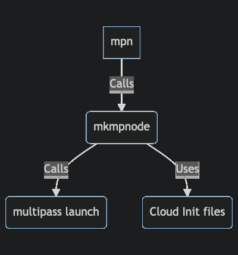

# Quickstart

New nodes can now be created with either `mkmpnode` or `mpn`:  
&nbsp;
* `mkmpnode` - (*Make Multipass Node*). A generic utility to create a single node
  with arbitrary specifications and specified (or default) cloud-init files. Run `mkmpnode -h` for an explanation and options.  
  &nbsp;

* `mpn` - (*Multipass Named Nodes*). A utility to create one or more nodes at the same time based on naming
  convention of nodes. The Node naming convention controls both the size of the node and the cloud-init specification used.  
  &nbsp;

The relation between the scripts are shown in Figure 1.

<!--
```mermaid
graph TD
    A[mpn] -- >|Calls| B(mkmpnode)
    B -- > |Calls| C(multipass launch)
    B -- > |Uses|D(Cloud Init files) 
```
-->

  
***Figure 1:*** *Relation between scripts and the underlying `multipass`*

## Accessing the node

When the nodes are setup (using Cloud Init Files) the current users public SSH key are installed in the node
so that it can be easily accessed by ´ssh´ directly without any password hassle.


## Examples 

The following basic examples show how nodes can be created once the `mptools` package have been
installed. This is just a quick review without explaining all details, the details 
are explained in the rest of the user guide. The purpose of these examples are just to give the reader
enough to determine if this package is a good fit for purpose.

### Creating nodes using naming convention
1. `mpn ub22fl01` - Create a node based on Ubuntu 22 LTS with a full development
   configuration (**f**) in a large (**l**) size node.
2. `mpn ub18bs01` - Create a node based on Ubuntu 18 LTS with a basic (**b**) node configuration (no development environment) in a small (**s**) node.
3. `mpn ub20ms01 ub20ms02` - Create two nodes, both based on Ubuntu 20 LTS, minimum development configuration (**m**) in a small (**s**) node.

### Creating nodes using the full configuration 
1. `mkmpnode -m 1GB mynode` - Create a node with 1GB RAM, use the default cloud-config file and name it *mynode*.
2. `mkmpnode -m 2GB -d 10GB -c pg-config.yaml db-server` - Create a node named db-server with Posgresql database cloud-init config with 2GB RAM and 10GB disk.  


&nbsp;


@note In the rest of this documentation it is assumed that the package have been installed and
that links to the scripts have been created in `/usr/local/bin` and that this path is included in the `$PATH` shell variable.

